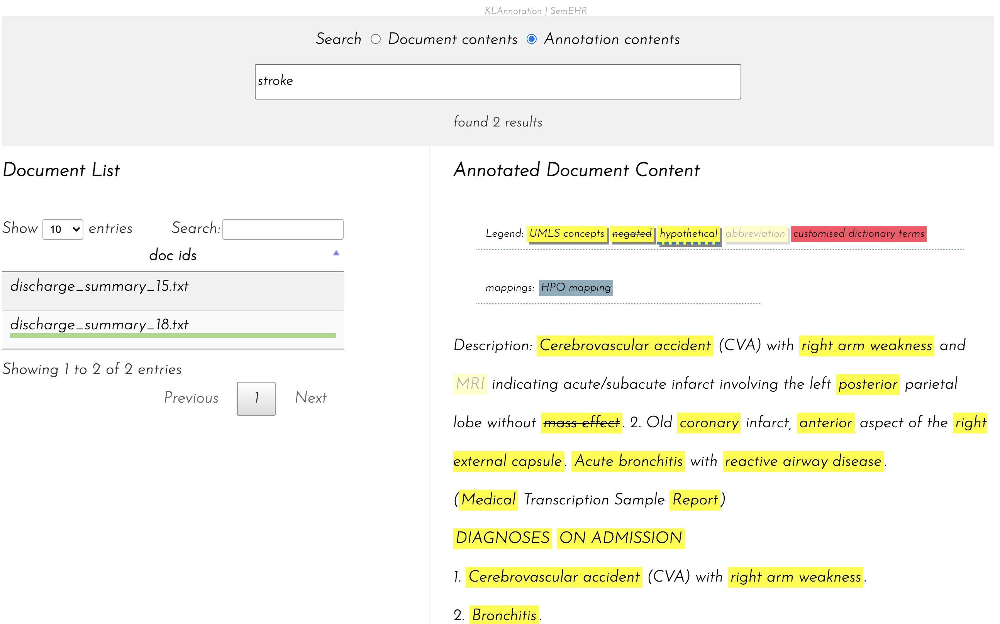

# klannotation

A lightweight annotation visualisation tool

## run klannotation using `docker-compose`
1. edit `klannotation-compose.yml`
   - replace `PATH_TO_ANNOTATION_FOLDER` with the full path to the folder containing the full texts (`input_docs`) and annotations (`semehr_results`)
   - replace `PATH_TO_KLANNOTATION_REPO` with the full path to the cloned repo of `klannotation`

2. run it
    ```bash
    docker-compose -f klannotation-compose.yml up -d
    ```
### optional settings
1. Create mappings. Mappings are basically filters to map UMLS concepts (CUIs) to another vocabulary, for example, HPO (check [this predefined mapping](https://github.com/Honghan/klannotation/blob/master/mappings/hpo-umls-mapping.json)). Mapping can be loaded by adding them into `conf/settings.json`.
   
2. Add passphrase to protect your project. Edit `conf/settings.json` by adding a line like the following. The UI will ask the user to input the passphrase and all API calls will need it as well.
   ```
   "passphrase": "123"
   ```
   
## web ui
The browser based UI can then be accessed via http://SERVER_IP:8000/vis/. 



## RESTful API call
You can get annotations by using API calls, for example.
### get document details: `/api/doc_detail/`
```python
import requests

url = 'http://localhost:8000/api/doc_detail/001.txt'
response = requests.get(url)
print(response.content)
```
Response will be a dictionary like the following.
```javascript
{
  "content": "full-text-of-the-document",
  "anns": JSON dictionary
}
```
Full documentation of API calls: [here](https://github.com/Honghan/klannotation/wiki/API-Usage)
